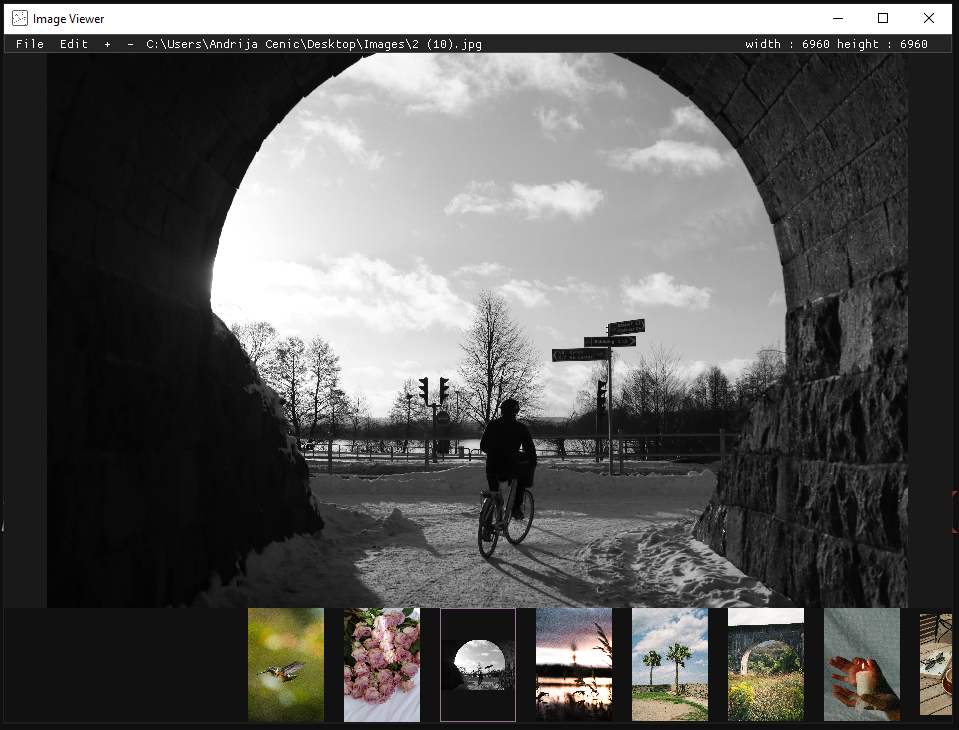
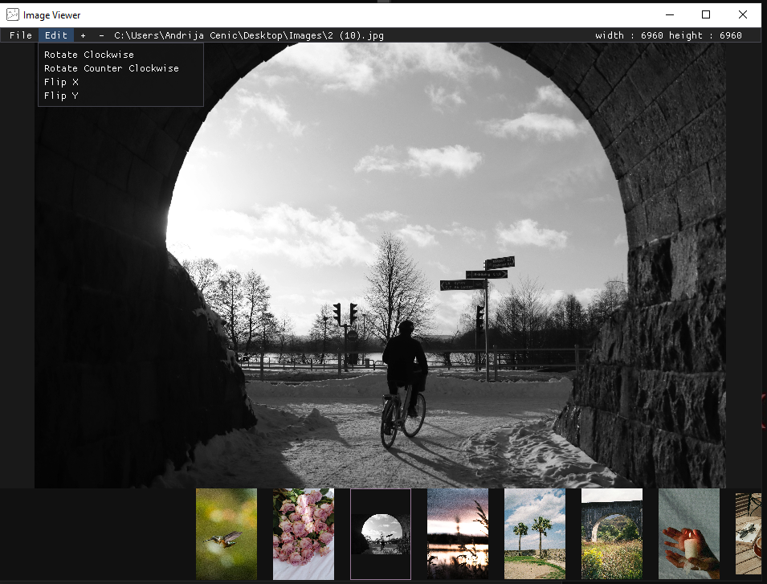
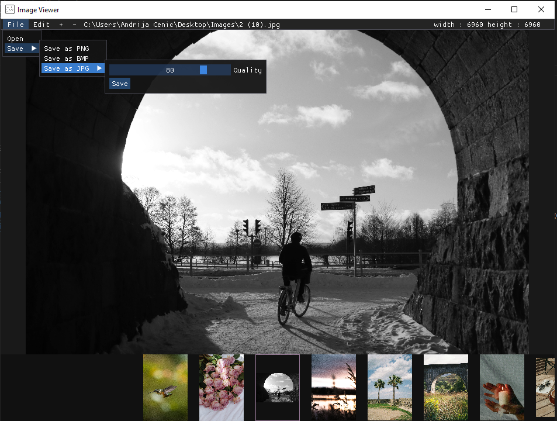

# Image Viewer
Is a OpenGL application for viewing and editing images.
The aplication uses OpenGL and Dear ImGui to render images to the screen.

### Libraries

Libraries used are : GLFW, Dear ImGui (OpenGL with GLFW), GLAD and stb(stb_image, stb_image_write)

### Building

For the GLFW, Dear ImGui and GLEW i used vcpkg and for stb follow the example on github.

library    | used version | description
------- | ---- | ------------------
**[imgui](https://github.com/ocornut/imgui)** | 1.89.9 | C++ GUI library (opengl3 and glfw bindings)
**[GLFW](https://www.glfw.org/)** | 3.3.8#2 | OpenGL library
**[GLAD](https://github.com/Dav1dde/glad)** | 0.1.36 |Vulkan/GL/GLES/EGL/GLX/WGL Loader-Generator based on the official specifications for multiple languages
**[stb](https://github.com/nothings/stb)** | latest | including stb_image and stb_image_write

Build with visual studio.